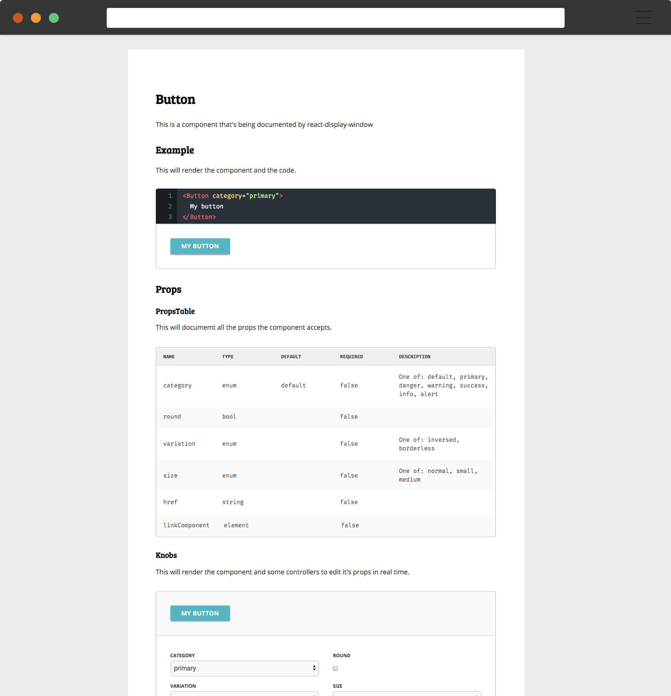

# React Display Window

React Display Window is a simple tool to write documentation for when having a full guide is overkill. React Display Window is therefore best suited for one component libraries or libraries where all of the components are related.

It's also very useful during the development stage of these components libraries because it allows you to see the code working and running like in a real usage environment.


# Installation

Install it as any other dev dependency in your repo:

```bash
$ npm install --development react-display-window
```

# Usage

First we create an `.mdx` file which would contain the documentation of the project. You can use React and markdown inside this file.

```mdx
// my-component.mdx

import { PlayGround, Knobs } from 'react-display-window';
import Button from './src';

# Button

This is a component that's being documented by react-display-window


## Example

This will render the component and the code.

<PlayGround>
  <Button category="primary">
    My button
  </Button>
</PlayGround>

## Props

### PropsTable

This will documemt all the props the component accepts.

<PropsTable component={Button} />

### Knobs

This will render the component and some controllers to edit it's props in real time.

<Knobs
  component={Button}
  defaults={{ category: 'primary' }}>
  <Button>
    My button
  </Button>
</Knobs>
```

Now, we just have to run React Display Window and point it to our file:

```bash
npx rdw serve my-component.mdx
```

And that's it. You can now go to the url display in your console a have a look at your newly created display window for your component.



Once you're happy with your documentation, you can run:

```bash
npx rdw build my-component --out-dir docs/
```

And this will build your documentation and make it available in the folder specified. Then, you can deploy it using github pages or any other static provider.


# Sponsors

Sponsored by:

<a href="https://www.drawbotics.com" target="_blank">
  
</a>

# License

[MIT](LICENSE)
